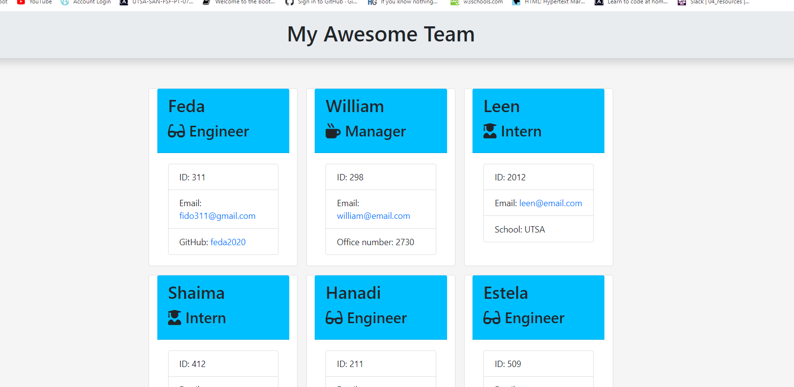

# CodeRepo-HM10-Template-Engine

## Description

  Build a softwear engineering team generator command line application. The app will prompt the user to enter information about the team member, and can enter any number of memebers and they can mix of angineers or interns. 

## Table of contents

* [Description](#Description)
* [Installation](#Installation)
* [Usage](#Usage)
* [Application walk through](#Application-walk-through)
* [HTMLoutput](#Picture)
* [Test](#Test)
* [Questions](#Questions)

## Installation

  installed node package

## Usage

  As a manager, I want to generate a webpage that displus my team's basic information so I will have a quick access to emails and github profiles.

## Application-walk-through

 

 ## Picture

 

## Test

  run npm test
  
  

## Questions
In case of any additional questions please visit my GitHub link: [Feda2020](https://github.com/Feda2020) 
Or don't hesitate to contact me via email: fido311@gmail.com
    